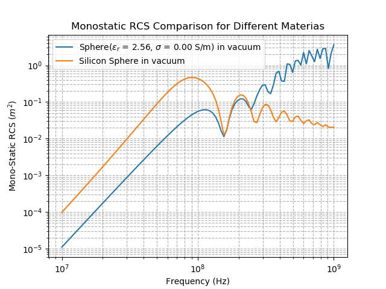
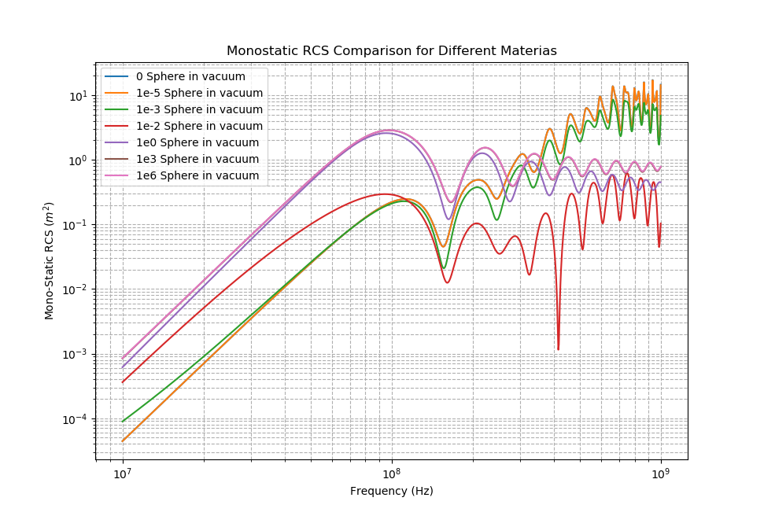
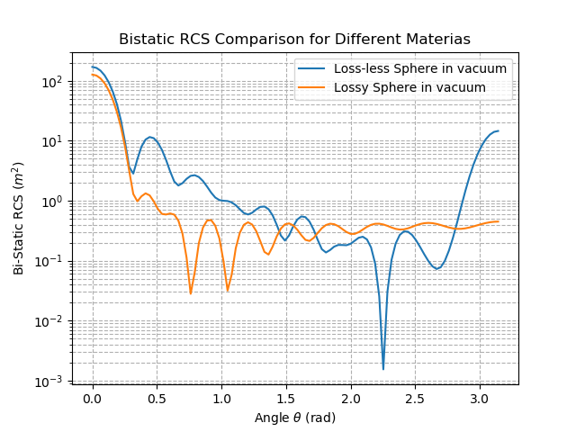

# Python Sphere RCS Calculator 

### This library uses the Mie Series to compute the Radar Cross Section for a lossy dielectric sphere.  The Radar Cross Section (RCS) can be computed and plotted for a variety of test scenarios, such as:
* mono-static RCS versus frequency for one or many spheres
* bi-static RCS for one or many spheres with different materials
* bi-static RCS for one sphere at multiple frequencies

This library "IN PROGRESS" can handle high frequencies and high conductivities than other publicly available RCS Solvers, such as the KZHU sphere scattering. This is accomplished by employing arbitrary precision arithmetic for critical portions of the calculation. The resutls of this library have been cross-validated with numerical solvers. 

The primary application of this library is to provide Radar Cross Section data for a variety of test scenarios (see above). This is similar to calculating the back-scattering cross-section used in many plasmonics and atmospheric blah blah blah applications. To convert wetween RCS and q_back, use the relation: 
 blah blah blah. 

Also include a section on how to use the arbitrary precision. (upload the bessel_arbitrary_precision.py file)

&nbsp;

### The code is supplemented by several functions for generating, saving, and plotting RCS data. Since the Mie Series produces an analytical result, this code can be used to verify results obtained using numerical computational electromagnetic solvers.

&nbsp;

### This code is primarily based on the following works:
1. C. A. Balanis, Advanced Engineering Electromagnetics. New York, NY: John Wiley & Sons, Inc., 1989.
2.  G. Kevin Zhu (2021). Sphere scattering (https://www.mathworks.com/matlabcentral/fileexchange/31119-sphere-scattering), MATLAB Central File Exchange.
3. W. J. Wiscombe, "Improved Mie scattering algorithms," Appl. Opt. 19, 1505-1509 (1980)
4. Allardice, J. R., & Le Ru, E. C. (2014). Convergence of Mie theory series: criteria for far-field and near-field properties. Applied Optics, 53(31), 7224. doi:10.1364/ao.53.007224

&nbsp;

### Contributors to this library:
* Iliya Shofman, Damian Marek, Shaswat Sharma, Piero Triverio  

&nbsp;

# Code Requirements
* Python version 3.x
* `numpy`, `matplotlib`, `scipy.special`, `mpmath`

&nbsp;

## Coordinate System
The calculations in this library assume that an x-polarized wave travels in the positive z- direction. Theta (the polar angle) is zero at the positive z-axis, reaches maximum value of pi at the negative z-axis. Phi (the angle of azimuth) is zero at the positive x-axis. 

To observe differences caused by plane wave polarization in the bistatic case, change the phi variable. For example, to see RCS from y-polarized waves, set phi = pi/2. For circularly polarized waves, compute as a linear superposition of two modes. 


# Example Usage

This section will show example code for creating frequently-used plots. This code can be pasted into the `main` function in the file `getRCS.py`. For questions about individual functions, please see the docstrings. 

## Mono-Static RCS vs Frequency for One Sphere
This example computes the monostatic RCS for a Perfect Electric Conductor. The material definition for the PEC comes from Balanis 1989. The code produces a plot (`PEC.png`) and saves the data to a text file (`PEC.txt`).
```
RCS_vs_freq(radius = 0.5, ratio = np.arange(0.01,1.61,0.01), \
            background_material = DielectricMaterial(1,0), \
            sphere_material = DielectricMaterial(1e8,0,1e-8,0), \
            sensor_location = [0,0,-2000], save_file = 'PEC')
```


Note: the variable `ratio` is defined as `radius / wavelength`. To have the x-axis be in terms of `ratio`, use function `plotOneMonoRCS()`. This function accepts either `ratio`, `frequency`, or `wavelength`, and plots it on the x axis. :
```
radius = 0.5 #meters
ratio = np.arange(0.01,1.61,0.01)
background = DielectricMaterial(1,0)
sphere_material = DielectricMaterial(2.56,0.003)
sensor_location = [0,0,-2000] #meters

(freq, mono_RCS) = RCS_vs_freq(radius, ratio, background, sphere_material, \
                        sensor_location , save_file = 'PEC', show_plot = 0)
plotOneMonoRCS(radius, sphere_material, background, mono_RCS, ratio = ratio, \
                savefile = "lossy_dielectric_mono_rcs")
```


&nbsp;

## Bi-Static RCS (vs angle) for One Sphere
The code sample below displays a plot of Bistatic RCS for a lossy dielectric sphere, and saves this data to a text file. The first function calculates and returns a numpy array with Bistatic RCS data, along with displaying the plot. The second function saves the data to a file, without saving the plot. To not display the plot, set `show_plot=0`. 
```
radius = 0.5
background = DielectricMaterial(1,0)
sphere = DielectricMaterial(2.56,0.01)
distance = 2000 
phi = 0
(theta, bi_RCS) = Bistatic_RCS(radius, 1e9, background, sphere, distance, phi, show_plot=1)
saveBiRCSData("bistatic_perfect_dielectric_example", bi_RCS, theta, 1e9, sphere)
```


&nbsp;

## Mono-Static RCS vs Frequency for Multiple Spheres
For plotting multiple spheres, use the `Compare_RCS_vs_freq()` function, or the `plotFromFile` function. Each plot line represents RCS data for one `TestCase`, in which a sphere of size `radius` and material `sphere_material` is immersed in a `background_material`. Each `TestCase` can be evaluated under one or many `TestParameters`, which include `sensor_location` and `frequency`.

```
#class TestCase(radius, sphere_material, background_material)
case1 = TestCase(0.5, DielectricMaterial(2.56,0), DielectricMaterial(1,0))
case2 = TestCase(0.5, DielectricMaterial(2.56,0.1, name = "Silicon"), DielectricMaterial(1,0))

#class TestParameters(cartesian_sensor_location, frequency)
param1 = TestParameters([0,0,-2000], np.logspace(7,9,100))

Compare_RCS_vs_freq([case1,case2], param1, "example_2_material_comparison")
```

  

### Conductivity Sweep 
To plot the RCS of a sphere at many different conductivities, one can automate the process of creating `TestCase` objects like this:
```
vacuum = DielectricMaterial(1,0)
radius = 0.5
conductivities = [0, 1e-5, 1e-3, 1e-2, 1e0, 1e3, 1e6]
names  = ["0", "1e-5", "1e-3", "1e-2", "1e0", "1e3", "1e6"]
eps_r, mu_r = 2.56, 1

cases = []
for i in range(0, len(conductivities)):
    sphere = DielectricMaterial(eps_r, conductivities[i], mu_r, name = names[i])
    test_case = TestCase(radius, sphere, vacuum)
    cases.append(test_case)

sensor_location = [0,0,-2000]       #[x,y,z], all in meters
frequency = np.logspace(7,9,1000)
param1 = TestParameters(sensor_location, frequency)

Compare_RCS_vs_freq(cases, param1, save_file = "sigma_sweep_kzhu_nmax")
```


&nbsp;

## Bi-Static RCS for one Sphere at Multiple Frequencies
Using the function `Compare_Bistatic_RCS`, one can compare the RCS of multiple spheres at the same frequency, or one sphere at multiple frequencies. This example shows both. 
### Bistatic RCS for two spheres, one frequency
```
vacuum = DielectricMaterial(1,0)
radius = 0.5
sphere1 = DielectricMaterial(2.56,0, 1,0, name = "Loss-less")
sphere2 = DielectricMaterial(2.56,1, 1,0, name = "Lossy")
test_cases = [TestCase(radius, sphere1, vacuum), TestCase(radius, sphere2, vacuum)]

sensor_location = [0,0,-2000]
frequency = 1e9
test_parameters = TestParameters(sensor_location, frequency)

Compare_Bistatic_RCS(test_cases, test_parameters, save_file = "compare_bistatic_materials")
```


### Bistatic RCS for one sphere, two frequencies
```
vacuum = DielectricMaterial(1,0)
radius = 0.5
sphere3 = DielectricMaterial(2.56,3.3, 1,0, name = "Lossy")
test_cases = [TestCase(radius, sphere3, vacuum)]

sensor_location = [0,0,-2000]
frequency = [1e9, 3e9, 5e9]
test_parameters = TestParameters(sensor_location, frequency)

Compare_Bistatic_RCS(test_cases, test_parameters, save_file = "compare_bistatic_frequencies")
```


